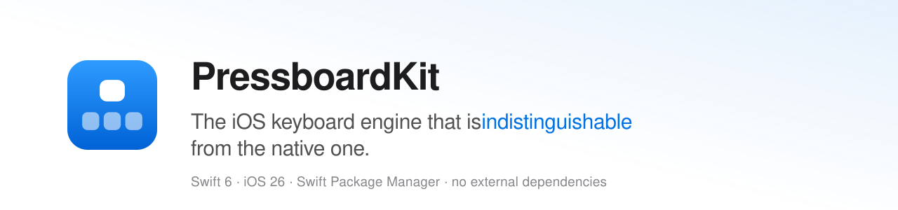

<p align="center">
  <picture>
    <source media="(prefers-color-scheme: dark)" srcset=".github/banner-dark.svg">
    
  </picture>
</p>

<p align="center">
  
  
  
  
  <a href="https://pressboardkit.com"></a>
</p>

A self-contained **iOS keyboard engine** in Swift — layout rendering, callouts, shift/caps,
spacebar-drag cursor, autocorrect, next-word prediction, slide-to-type, emoji and feedback — with
**no dependency on any host app**.

## Primary goal — indistinguishable from the native iOS keyboard
The keyboard **must look and behave exactly like the native iOS keyboard**: same visuals, same
feel, same typing experience — users must not be able to tell the difference. That is the
overriding "done" criterion for every visual and interaction feature, and it takes precedence over
custom styling.

## Modules
| Product | Purpose |
|---|---|
| `PressboardKit` | Core engine: rendering, layout state, callouts, shift/caps, spacebar drag, feedback |
| `PressboardKitLayouts` | Data-driven layout tables + locale mapping; add a language = add a table |
| `PressboardKitAutocomplete` | `SuggestionProvider` + dictionary-based suggestions (optional; ~15 MB of word lists) |
| `PressboardKitEmoji` | Emoji panel — catalog, skin tones, recents, UIKit grid (optional) |
| `PressboardKitApp` | `PressboardInputViewController` + `PressboardConfiguration` — the whole keyboard assembled |
| `PressboardKitLicensing` | `PressboardLicence.activate` — **app target only**; the extension must never link it |

## Requirements
- iOS 26+, Swift 6, Swift Package Manager.

## Installation
The engine ships as **binary frameworks** (one XCFramework per product), pinned by the checksums
in `Package.swift`:

```swift
.package(url: "https://github.com/PressboardKit/PressboardKit.git", from: "1.0.0")
```

Link the products to your **application** target as well as to the extension — that is what makes
Xcode process and embed the frameworks. The frameworks are built for library evolution, so the
engine's public enums are not frozen: a `switch` over one needs `@unknown default:`.

## Integration
Most integrations are one import and one overridden method:

```swift
import PressboardKitApp

final class KeyboardViewController: PressboardInputViewController {
    override func makeConfiguration() -> PressboardConfiguration {
        PressboardConfiguration(
            behavior: .pressboardDefault,   // or .standard for pure native
            locales: [.english]
        )
        .withLicence(appGroup: "group.com.acme.app", application: "com.acme.app")
    }
}
```

and, in your app, at launch:

```swift
import PressboardKitLicensing

await PressboardLicence.activate(key: "pbk_live_…", appGroup: "group.com.acme.app")
```

Everything host-specific (theme, toolbar UI, suggestion source, settings) is injected; the kit
never imports host code. **See [`INTEGRATION.md`](INTEGRATION.md) for the full guide** — quick
start, `KeyboardAction` routing, the complete `KeyboardBehavior` reference, Liquid Glass
transparency, styling, autocomplete/emoji/slide-to-type, licensing and App Group setup.

## Docs
- [`INTEGRATION.md`](INTEGRATION.md) — how to embed the kit in your app
- [`CHANGELOG.md`](CHANGELOG.md) — what changed, semver
- <https://pressboardkit.com/docs/> — the same material on the web

## Licence
PressboardKit is a commercial SDK, and it is **free**: there is no charge for a licence and no
tier above it. It is licensed rather than open — you register an application by product name and
bundle identifier, and a licence is issued against it at no charge. An application the engine
cannot verify runs the **free tier**: it types, in English, and every other behaviour stays quiet.
Terms: [`LICENSE`](LICENSE).

The bundled word-frequency lists come from Hermit Dave's FrequencyWords and are **CC BY-SA 4.0**,
not ours — `LICENSE` §7 carves them out of the terms that cover the engine. Provenance and the
full notice ship beside them in `CREDITS.txt`, inside the autocomplete framework.
